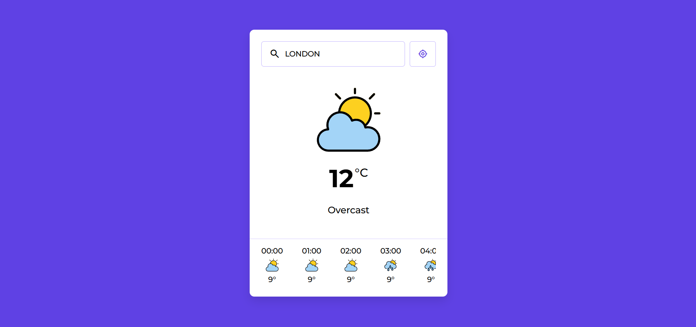

# Weather App

This is a simple and responsive weather application that allows users to search for weather details of any city or use their current location to get real-time weather updates. The app provides current weather conditions and an hourly forecast for the next 24 hours.

## Features

### 1. **Search Weather by City**
   - Users can search for weather details by entering the name of a city in the search bar.
   - The app fetches the current weather and a 24-hour forecast for the entered city.
   - The search input supports keyboard interaction, allowing users to press "Enter" to initiate the search.

### 2. **Get Weather by Current Location**
   - Users can click the "My Location" button to fetch weather details for their current location.
   - The app uses the browser's geolocation API to get the user's latitude and longitude.
   - If location access is denied, the app displays an alert notifying the user.

### 3. **Current Weather Display**
   - The app shows the current temperature, weather description, and an appropriate weather icon based on the weather condition.
   - Icons are dynamically loaded from the `icons/` folder, matching the weather condition codes.

### 4. **Hourly Weather Forecast**
   - Displays the hourly forecast for the next 24 hours.
   - Each hourly forecast includes:
     - Time
     - Temperature
     - Weather icon
   - The forecast is scrollable horizontally for easy navigation.

### 5. **Error Handling**
   - If the app fails to fetch weather details (e.g., invalid city name or network issues), a "No Results" message is displayed with an appropriate icon and message.

### 6. **Responsive Design**
   - The app is fully responsive and works seamlessly on both desktop and mobile devices.
   - The layout adjusts dynamically to fit smaller screens, ensuring a user-friendly experience.

## Folder Structure
- **`icons/`**: Contains weather icons for different weather conditions.
- **`screenshot/`**: Contains a screenshot of the app.
- **`script.js`**: Contains the JavaScript logic for fetching and displaying weather data.
- **`style.css`**: Contains the CSS for styling the app.
- **`index.html`**: The main HTML file for the app.

## How It Works
1. The app uses the [WeatherAPI](https://www.weatherapi.com/) to fetch weather data.
2. Weather conditions are mapped to custom icons using predefined weather codes.
3. The app dynamically updates the DOM to display the fetched weather details.

## Live Demo
Check out the live version of the app here: [Weather App Live Demo](https://amanhaidry.github.io/weather-app/)

## Technologies Used
- HTML5
- CSS3
- JavaScript (ES6+)
- WeatherAPI for weather data

## How to Run Locally

### Get Your Free API Key
1. Sign up for an account at [WeatherAPI](https://www.weatherapi.com/signup.aspx).
2. Navigate to the [API key](https://www.weatherapi.com/my) section and get your API key.

### Insert Your API Key
1. Open your project folder in VS Code.
2. Locate the `script.js` file in your project.
3. Find the `API_KEY` variable and replace with your API key.

### Save and Test
1. Save the `script.js` file after adding your API key.
2. Open the `index.html` file in your preferred browser to test your Weather App and ensure it's functioning correctly.

---

Happy coding!